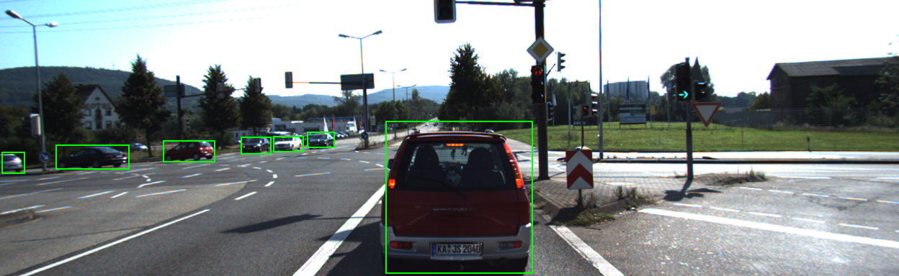
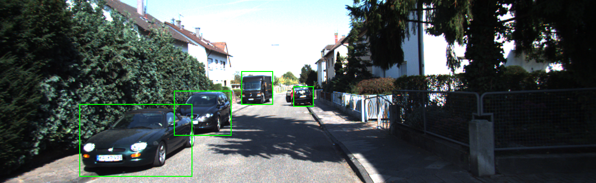
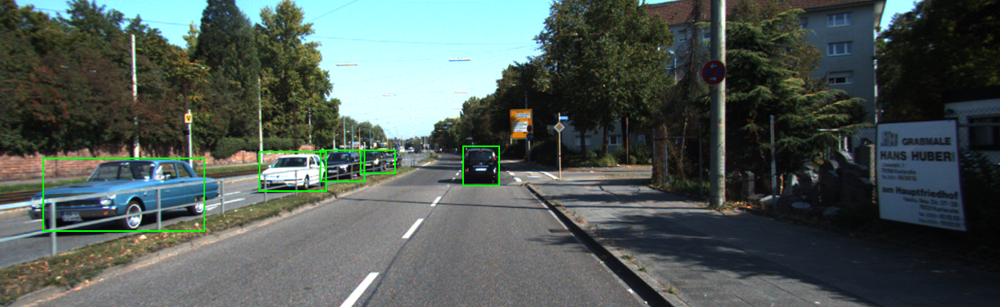
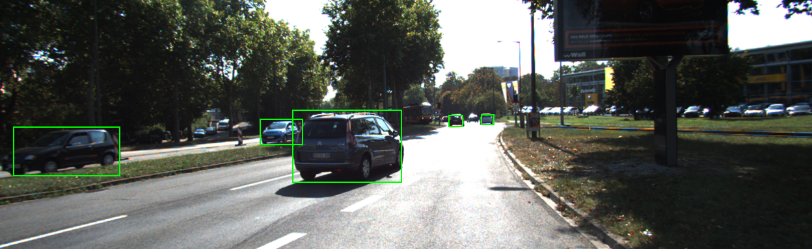

# KittiBox

KittiBox is a collection of scripts to train out model FastBox on the [Kitti Object Detection Dataset](http://www.cvlibs.net/datasets/kitti/eval_object.php). A detailed description of Fastbox can be found in our [MultiNet paper](https://arxiv.org/abs/1612.07695).

   

   

FastBox is designed to archive a high detection performance at a very fast inference speed. On Kitti data the model has a throughput of 28 fps (36ms), and is more than double as fast as FasterRCNN. Despite its impressive speed FastBox outperforms Faster-RCNN significantly.


Task          | moderate   |    easy      | hard          |   speed (ms) | speed (fps)
--------------|------------|--------------|---------------|------------- |----------
FastBox       |    86.45 %     |   92.80 %  |   67.59 %    |  35.75 ms   |  27.97
Faster-RCNN<sup>[1](#myfootnote1)</sup>   |    78.42 %     |   91.62 %  |   66.85 %    |  78.30 ms    |  12.77

The code contains for `train`, `evaluate` and `visualize` FastBox in tensorflow. It is build to be compatible with the [TensorVision](http://tensorvision.readthedocs.io/en/master/user/tutorial.html#workflow) backend which allows to organize experiments in a very clean way. Also check out [KittiSeg](https://github.com/MarvinTeichmann/KittiSeg#kittiseg) a similar project implementing a state-of-the-art road segmentation model. The code for joint inference can be found in the [MultiNet](https://github.com/MarvinTeichmann/MultiNet) repository.

## Requirements

The code requires Tensorflow 1.0 as well as the following python libraries: 

* matplotlib
* numpy
* Pillow
* scipy
* runcython

Those modules can be installed using: `pip install numpy scipy pillow matplotlib runcython` or `pip install -r requirements.txt`.

## Tensorflow 1.0rc

This code requires `Tensorflow Version >= 1.0rc` to run. There have been a few breaking changes recently. If you are currently running an older tensorflow version, I suggest creating a new `virtualenv` and install 1.0rc using:

```bash
export TF_BINARY_URL=https://storage.googleapis.com/tensorflow/linux/gpu/tensorflow_gpu-1.0.0rc0-cp27-none-linux_x86_64.whl
pip install --upgrade $TF_BINARY_URL
```

Above commands will install the linux version with gpu support. For other versions follow the instructions [here](https://www.tensorflow.org/versions/r1.0/get_started/os_setup).

## Setup

1. Clone this repository: `git clone https://github.com/MarvinTeichmann/KittiBox.git`
2. Initialize all submodules: `git submodule update --init --recursive`
3. Run `cd submodules/utils && make` to build cython code
4. [Optional] Download Kitti Object Detection Data 
    1. Retrieve Kitti data url here: [http://www.cvlibs.net/download.php?file=data_object_image_2.zip](http://www.cvlibs.net/download.php?file=data_object_image_2.zip)
    2. Call `python download_data.py --kitti_url URL_YOU_RETRIEVED`
5. [Optional] Run `cd submodules/KittiObjective2/ && make` to build the Kitti evaluation code (see [submodules/KittiObjective2/README.md](submodules/KittiObjective2/README.md) for more information)

Running `demo.py` does not require step 4. and step 5. Those steps are only required if you want to train your own model using `train.py` or bench a model against the official evaluation score using `evaluate.py`. Also note, that I strongly recommend using `download_data.py` instead of downloading the data yourself. The script will also extract and prepare the data. See [Managing Folders](README.md#managing-folders) if you like to control where the data is stored.

#### Microsoft Windows Users

This project is developed, tested and maintained on a Linux operation system. It is written to be compatible with Windows, however a few modification are neccasary. You can find instructions on how to make the code run under Windows [here](https://github.com/Khaos/DD2017/tree/kittiEdit/Code/KittiBox#kittibox------implementation-on-windows10-geforce960).

In general I would however suggest to install Linux, at least on a virtual system. Getting used to Linux is not that hard and most Deep Learning Code is written for Linux. On the long run you will save yourselfe quite a bit of pain.


#### Update installation

To update an existing KittiBox installation do:

1. Pull all patches: `git pull`
2. Update all submodules: `git submodule update --init --recursive`

If you forget the second step you might end up with an inconstant repository state. You will already have the new code for KittiBox but run it old submodule versions code. This can work, but I do not run any tests to verify this.

## Tutorial

### Getting started

Run: `python demo.py --input_image data/demo.png` to obtain a prediction using [demo.png](data/demo.png) as input.

Run: `python evaluate.py` to compute train and validation scores.

Run: `python train.py` to train a new model on the Kitti Data.

If you like to understand the code, I would recommend looking at [demo.py](demo.py) first. I have documented each step as  	thoroughly as possible in this file.

### Modifying Model & Train on your own data

The model is controlled by the file `hypes/kittiBox.json`. Modifying this file should be enough to train the model on your own data and adjust the architecture according to your needs. You can create a new file `hypes/my_hype.json` and train that architecture using:

`python train.py --hypes hypes/my_hype.json`


For advanced modifications, the code is controlled by 5 different modules, which are specified in `hypes/kittiBox.json`.

```
"model": {
    "input_file": "../inputs/idl_input.py",
    "architecture_file" : "../encoder/vgg.py",
    "objective_file" : "../decoder/fastBox.py",
    "optimizer_file" : "../optimizer/generic_optimizer.py",
    "evaluator_file" : "../inputs/cars_eval.py"
},
```

Those modules operate independently. This allows easy experiments with different datasets (`input_file`), encoder networks (`architecture_file`), etc. Also see [TensorVision](http://tensorvision.readthedocs.io/en/master/user/tutorial.html#workflow) for a specification of each of those files.


## Managing Folders

By default, the data is stored in the folder `KittiBox/DATA` and the output of runs in `KittiBox/RUNS`. This behaviour can be changed by adjusting the environoment Variabels: `$TV_DIR_DATA` and `$TV_DIR_RUNS`.

For organizing your experiments you can use:
`python train.py --project batch_size_bench --name size_5`. This will store the run in the subfolder:  `$TV_DIR_RUNS/batch_size_bench/size_5_%DATE`

This is useful if you want to run different series of experiments.


## Utilize TensorVision backend

KittiBox is build on top of the TensorVision [TensorVision](https://github.com/TensorVision/TensorVision) backend. TensorVision modulizes computer vision training and helps organizing experiments. 


To utilize the entire TensorVision functionality install it using 

`$ cd KittiBox/submodules/TensorVision` <br>
`$ python setup install`

Now you can use the TensorVision command line tools, which includes:

`tv-train --hypes hypes/KittiBox.json` trains a json model. <br>
`tv-continue --logdir PATH/TO/RUNDIR` continues interrupted training <br>
`tv-analyze --logdir PATH/TO/RUNDIR` evaluated trained model <br>


## Useful Flags & Variabels

Here are some Flags which will be useful when working with KittiBox and TensorVision. All flags are avaible across all scripts. 

`--hypes` : specify which hype-file to use <br>
`--logdir` : specify which logdir to use <br>
`--gpus` : specify on which GPUs to run the code <br>
`--name` : assign a name to the run <br>
`--project` : assign a project to the run <br>
`--nosave` : debug run, logdir will be set to `debug` <br>

In addition the following TensorVision environoment Variables will be useful:

`$TV_DIR_DATA`: specify meta directory for data <br>
`$TV_DIR_RUNS`: specify meta directiry for output <br>
`$TV_USE_GPUS`: specify default GPU behavour. <br>

On a cluster it is useful to set `$TV_USE_GPUS=force`. This will make the flag `--gpus` manditory and ensure, that run will be executed on the right gpu.

# Acknowledge

This project started out as a fork of [TensorBox](https://github.com/TensorBox/TensorBox).

-------

<a name="myfootnote1">1</a>: Code to reproduce the Faster-RCNN can be found [here](https://github.com/MarvinTeichmann/kitti). The repository contains the official py-faster-rcnn code applied to the Kitti Object Detection Dataset.
